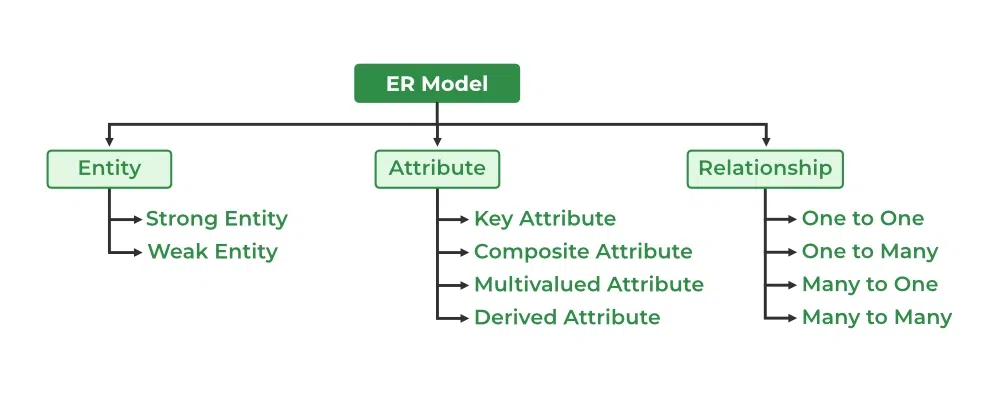
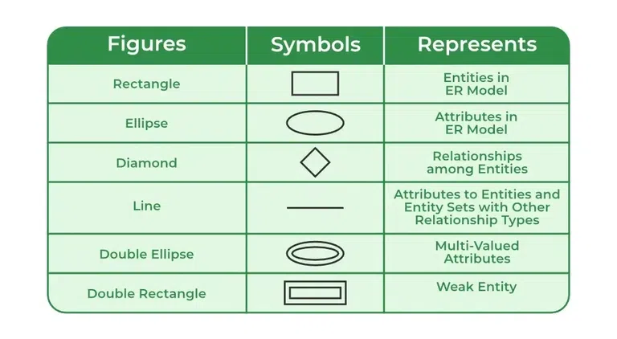

# ER-model

## Key Concept
```sh
1. Er model have entity , attributes , and relations
entity is represent by rendtengle .. it has tow types. one s strong and another is weak . weak is  reprepesnet by double rectangle .

2. there are some attribute and these are as follows 1. key attributes . 2. composite. 3 multivlaued .4.Drived
Complex=composite+multivaluede

3. cardinality of is shows the number of rows.

4. attributes is a number of colom and name.

5. domain is a set of values.


```

## Question 1.
```sh
Stament 1 : Composite attributes cannot be devide into smallest part .    
false

Stament 2 : Complex attributes is foremd by nesting composite attribute and multivalued attrinutes.
true

Stament 3 : Derived attrinute is whose value are composed to other attrinutes.
true

```

## Question 2.
```sh
Satammetn 1 : Realtional db schema represent the logical design to the db.
true

Statement 2 : Current snapshot of a relation only prove the degree of relation.
false
```

## Question 3.
```sh
which of the folowing stattement is correct accrdingly to the following .instance of the relations, shcem
R{x,y,z}

{{x,y,z},
 {1,1,a},
 {1,1,a,},
 {2,1,b},
 {3,2,b}

 answer : x->y and x->z
}
```
## Question 4.
```sh
let x,y,z,a,b,c be the attributes of an entity set if {x},{x,y},{a,b},{a,b,c},{x,y,z} super key then which of the following are cadndidate key.
a. {x,y} & {a,b}
b. {x} & {a,b}
c. {x,y,z} & {a,b,c}
d. {z} & {c}

Answer: b
```

## Question 5.
```sh
Statement : 1 every take whith two single vlued attributes is in  1 nf, 2 nf and bcnf

statement 2: ab->c ,b->e ,e->c is a minimal cover for the set of 
fd's:ab->c, d->e, ab->e, e->c
```

## Question 6.
```sh
consider the following  relation x(s,si,c) , y(s,p,d)
Table ->x

| s | si  | c  |
|:--|:---:|---:|
| J | 1   | m  |
| B | 2   | n  |
| R | 3   | h  |
| T | 4   | g  |

Table ->y
| s | p   | d   |
|:-:|:---:|----:|
| J | s1  | ca  |
| B | p2  | mb  |
| R | m1  | dc  |
| A | h1  | md  |

perform right join to x and y

Answer:-

| s |  p   |  d  |  si |  c  |
|:--|:----:|----:|:---:|:---:|
| J | s1   | ca  |  1  |  m  |
| B | p2   | mb  |  2  |  n  |
| R | m1   | dc  |  3  |  h  |
| A | h1   | md  | null| null|


```



```sh
Entity: An objects that is stored as data such as Student, Course or Company.
Attribute: Properties that describes an entity such as StudentID, CourseName, or EmployeeEmail.
Relationship: A connection between entities such as "a Student enrolls in a Course".
```

## Symbols Used in ER Model
```sh
ER Model is used to model the logical view of the system from a data perspective which consists of these symbols:

Rectangles: Rectangles represent entities in the ER Model.
Ellipses: Ellipses represent attributes in the ER Model.
Diamond: Diamonds represent relationships among Entities.
Lines: Lines represent attributes to entities and entity sets with other relationship types.
Double Ellipse: Double ellipses represent multi-valued Attributes, such as a student's multiple phone numbers
Double Rectangle: Represents weak entities, which depend on other entities for identification.
```



